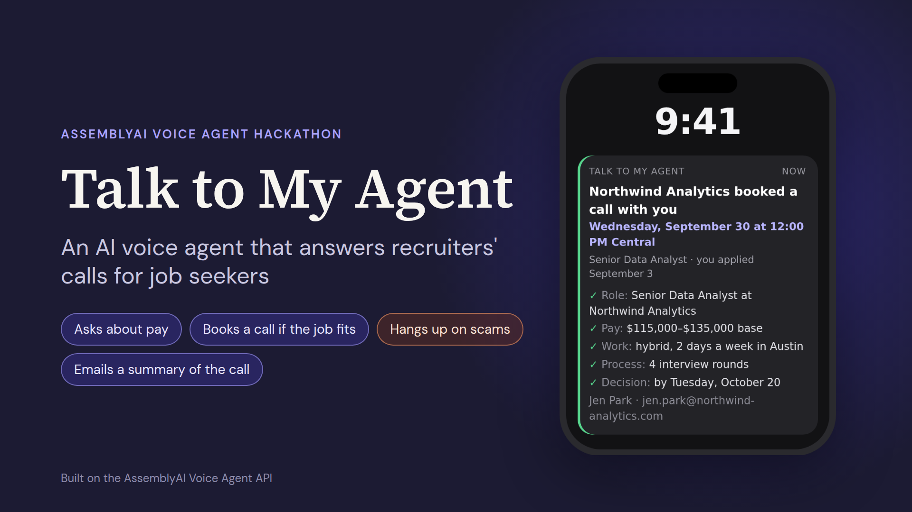
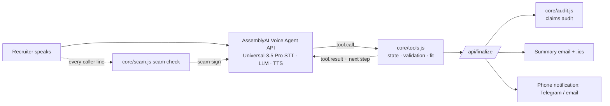

# Talk to My Agent

**An AI voice agent that answers recruiters' calls for job seekers.**

**Try it:** https://talk-to-my-agent-umber.vercel.app (use Chrome and headphones)



Actors and athletes have an agent who takes the first call about a job and asks about money first. Job seekers take those calls alone, often at work and unprepared, and afterwards nothing the recruiter said is in writing.

Talk to My Agent answers the phone number on a job seeker's résumé. In the demo, the job seeker is Maya Chen, a fictional senior data analyst in Austin. When a recruiter calls, the agent:

1. **Recognizes the job.** It matches the caller to the jobs Maya applied for: "Maya applied for that role on September 3."
2. **Asks about pay and work.** It asks the questions that feel awkward to ask: the pay range, remote or office days, the number of interviews, and when she'll hear back.
3. **Books a call if the job fits.** It checks the answers against Maya's minimum pay and deal-breakers before it offers any times.
4. **Hangs up on scams.** It ends the call if the caller asks for fees, equipment purchases, bank details or ID before an offer, or wants to interview over a chat app.
5. **Gets it in writing.** It reads every detail back on the call, and a minute later the recruiter gets an email with only what they confirmed, plus a calendar invite.

Maya gets a notification on her phone with the details and the booked call. She doesn't have to pick up.

Every voice agent in hiring today works for the employer. This one works for the job seeker.

## Our code makes the decisions, and the AI model does the talking

- **Our code writes the read-backs** from stored values, and only details the caller confirmed out loud go into the email.
- **Our code decides whether a job fits**, using Maya's minimum pay, remote or office preferences and deal-breakers. The agent can't offer times for a job that doesn't fit.
- **Our code checks everything the caller says for signs of a scam.** If the agent misses one, the page tells it to end the call.
- **After the call, our code re-reads everything the agent said** and reports any salary figure, quote, booking or date that neither Maya recorded nor the caller said.
- When a recruiter asks about Maya, the agent can **only use answers she recorded herself**.

## Try it

Open [the app](https://talk-to-my-agent-umber.vercel.app), press **Call Maya's agent**, and talk like a recruiter. The "Try it as…" cards give four scripts: a real recruiter, a recruiter who hides the pay, a low offer from an agency, and a job scammer. Use headphones and Chrome.

Maya Chen and every company in the demo are fictional.

## Run it locally

Requires Node.js 20 or newer. No runtime dependencies.

```sh
npm install                  # dev tools only: ws and playwright-core for tests
cp .env.example .env         # Windows: copy .env.example .env
# put your key in .env: ASSEMBLYAI_API_KEY=...
npm run smoke                # 30-second check of your key and the agent setup, no mic needed
npm run dev                  # http://localhost:3000
```

## Deploy to Vercel

1. Push this folder to a public GitHub repo.
2. In Vercel, **Add New → Project**, import the repo. Framework preset: **Other**. Leave build settings as they are (`vercel.json` serves `public/` and the functions in `api/`).
3. Add the environment variable `ASSEMBLYAI_API_KEY`. Deploy.

Anyone with the URL can start calls billed to your key. Each call is capped at 10 minutes and each IP at 20 calls an hour (`MAX_CALL_SECONDS`, `TOKENS_PER_IP_PER_HOUR`).

### Optional: real emails and phone notifications

- **Summary emails** with [Resend](https://resend.com): set `RESEND_API_KEY`, `RECEIPT_FROM=Talk to My Agent <onboarding@resend.dev>`, and `RECEIPT_TO_OVERRIDE=<your email>`. Without a verified domain Resend only delivers to your own address, so the demo sends every summary email there, marked with who it was really for.
- **Phone notifications** with Telegram: create a bot with @BotFather, message it once, read your chat id from `https://api.telegram.org/bot<TOKEN>/getUpdates`, then set `TELEGRAM_BOT_TOKEN` and `TELEGRAM_CHAT_ID`.

With neither set, the page shows the email and the phone notification as previews.

## How it uses AssemblyAI

- **Voice Agent API** over one WebSocket from the browser, opened with a short-lived token minted server-side (`/api/token`), so the API key never reaches the page.
- **Inline session configuration** built per call from the job seeker's profile: system prompt with today's date, greeting that says it's an AI assistant, nine client-side function tools, `keyterms` (her name, the companies she applied to, W-2, 1099, C2C, OTE…), and a `transcription_prompt` describing a recruiter call.
- **Universal-3.5 Pro Realtime**, the speech-to-text inside the Voice Agent API, is what makes the summary email possible: salary figures, dates, names and email addresses spelled letter by letter have to be heard correctly before our code reads them back.
- **Turn detection and barge-in**: the caller can interrupt at any time; interrupted replies drop their tool results, as the docs recommend.
- **`reply.create`** lets our code make the agent speak, which is how the scam check ends a call even when the model missed the warning sign.
- **Staying on the line.** Sometimes a reply comes back with nothing in it, usually after the caller says several details at once. When that happens, our code reads the details from the caller's own words, records them, and asks the agent to read them back. If replies keep coming back empty, the page opens a fresh session. That session first says a line our code wrote ("Sorry, the line cut out for a second. So that's… Did I get that right?"), and its prompt carries the call so far.
- **Playback that adapts to the connection.** The agent's audio arrives in real time with only about 100 ms sent ahead. The page holds 0.4 s before playing and adds more after each gap the caller hears.



## Files

```
public/index.html, styles.css, app.js   the demo page (audio adapted from AssemblyAI's starter)
public/core/candidate.js                the job seeker: requirements, recorded answers, applications
public/core/session.js                  prompt, greeting, tools, keyterms for session.update
public/core/tools.js                    the nine tool handlers and the call state
public/core/facts.js                    pay, work, email, phone, dates, time zones, fit
public/core/scam.js                     signs of a job scam, checked in code
public/core/extract.js                  role details read from the caller's words, in code
public/core/audit.js                    after-call check for anything made up
public/core/report.js                   outcome, summary email, calendar invite, phone notification
public/core/call.js                     live-call logic shared by the page and the eval
public/core/protocol.js                 tool-result queue and playout clock
server/handlers.js, deliver.js          token, finalize, email and Telegram delivery
api/*.js                                Vercel functions
scripts/dev-server.mjs                  local server
scripts/smoke.mjs                       real-API check without a microphone
eval/                                   bot-vs-bot eval on the real API
tests/                                  unit tests and offline end-to-end tests
```

## Tests

```sh
npm test         # unit tests: tools, fit, scam check, audit, summary email, protocol, call logic
npm run e2e      # the real page in headless Chromium, the smoke test and the eval
                 # harness, all against fake AssemblyAI servers (no key needed)
npm run smoke    # against the real API: token, session setup, greeting, two tool calls
```

## Eval: 13 simulated calls on the real API

```sh
npm run eval                 # every scenario, spoken, one call at a time (about 25 minutes, about $4)
npm run eval -- --list       # the scenarios
npm run eval -- scam_bank_ssn onsite_atlas
npm run eval -- --text       # typed turns: faster, but skips speech-to-text
```

Each call puts Maya's agent (the same session setup and call logic the page runs) on the line with a simulated caller: a second Voice Agent session with its own voice, facts and behavior, from a friendly recruiter and one who hides the pay to a low agency offer, a commission-only job, two job scams and a wrong number. Audio flows between the two sessions in real time, so every caller line goes through streaming speech-to-text, spelled email addresses included. Our code scores each call against the scenario's expected result: the outcome, each captured fact, the email address, the scam check, the check for anything made up, and how fast the agent replies. Results go to [`eval/RESULTS.md`](eval/RESULTS.md), with full transcripts in `eval/runs/`.

## What it doesn't do yet

- The demo takes calls in the browser. To answer a real phone number, the same agent can connect through Twilio (see AssemblyAI's [phone guide](https://www.assemblyai.com/docs/voice-agents/voice-agent-api/connect-to-twilio)), with the tools moved to server endpoints.
- One fictional job seeker, no accounts, no storage between calls.
- It can still mishear, which is why nothing goes into the email unless the recruiter confirmed it on the call.
- It says up front that it's an AI and that it takes notes. Call-recording rules differ by place; check yours before using it for real.

## License

MIT
